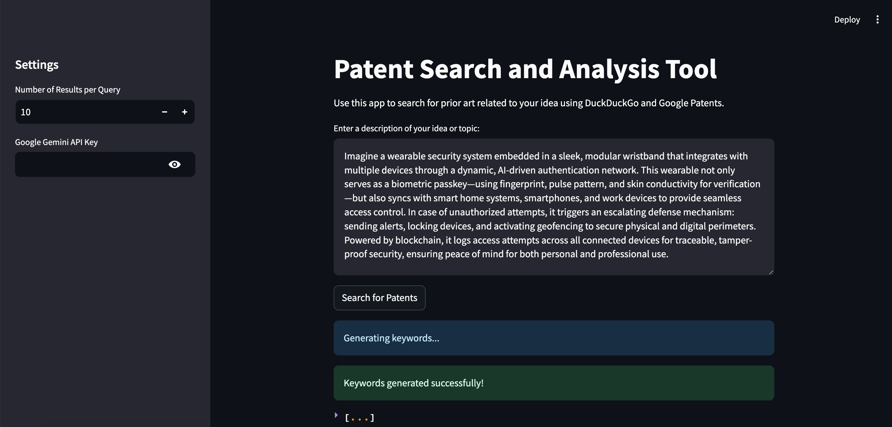
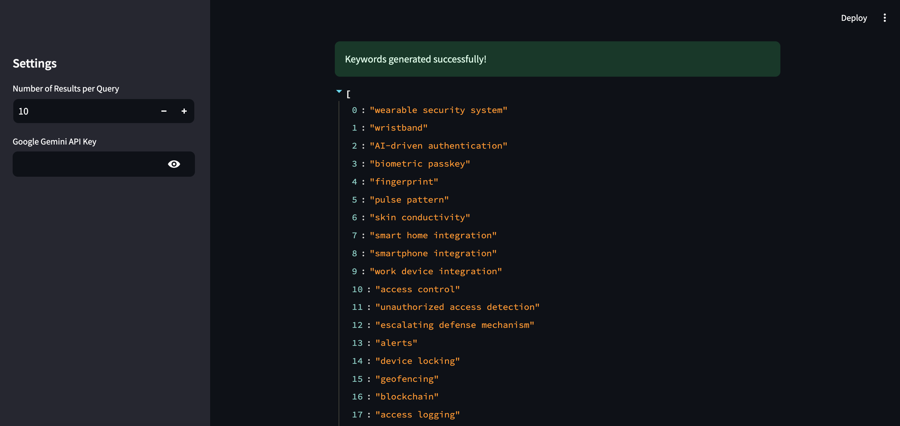
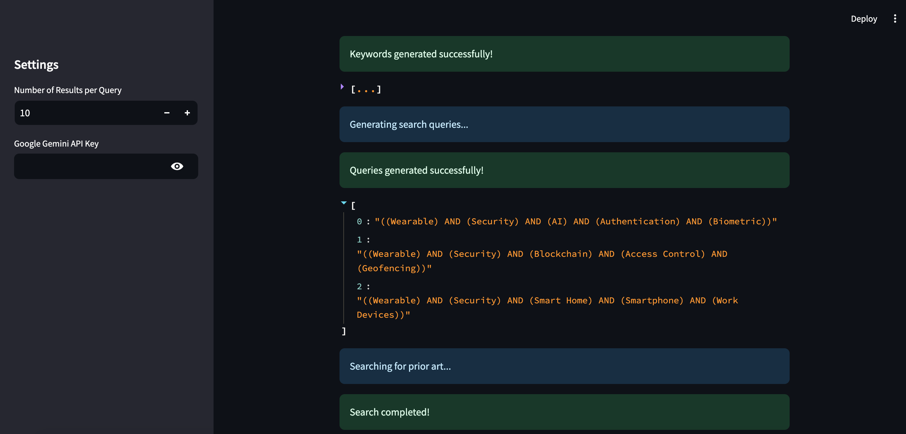
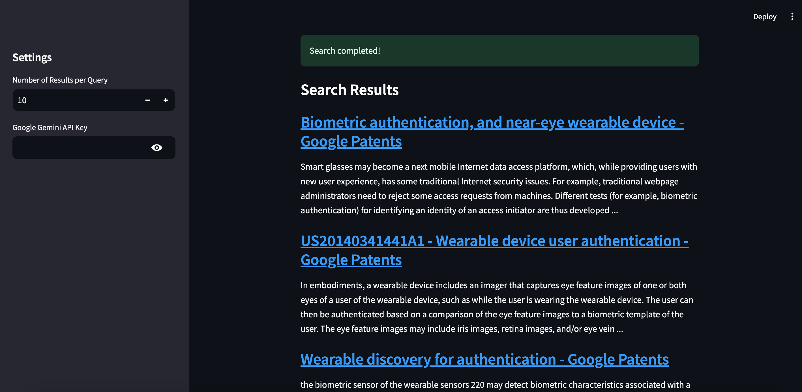

# 1. Patent Prior Art Search with LLMs and DDGS (DuckDuckGo) 
./app_patent
  
This repository provides a streamlined solution for performing patent similarity searches by leveraging the capabilities of Language Learning Models (LLMs) and Retrieval-Augmented Generation (RAG). The application integrates advanced tools such as Google Patent Database, DuckDuckGo search, and cutting-edge models like Google's Gemini (via Generative AI API) to generate keywords, build queries, and parse results efficiently.

### Features
- **Keyword Generation:** Generate relevant and diverse keywords for patent searches.
- **Query Optimization:** Create advanced search queries using Boolean and proximity operators for maximum recall and precision.
- **Web Search Integration:** Seamlessly search patent data from Google Patents using DuckDuckGo API.
- **Result Parsing:** Extract, parse, and display search results in a user-friendly DataFrame.
- **Streamlit App:** A professional, interactive web application for patent similarity searches, inspired by Google Patents' interface.

### Installation
Clone the repository:
```bash
git clone https://github.com/hissain/llmsearch.git
cd llmsearch/app_patent
```

Install the required dependencies:

```bash
langchain==0.0.213
duckduckgo-search==0.5
streamlit==1.24.0
pandas==2.1.0
openai==0.27.0
google-cloud==3.0.0
langchain-google-genai==0.0.1
requests==2.28.1
```

### Set up the necessary API keys:

**Google Gemini API:** Add your Google Gemini API key as an environment variable **GEMINI_API_KEY**.

### Run the Streamlit app:

```bash
streamlit run app.py
```

### Usage
1. Open the Streamlit app.
2. Enter your patent description in the provided text area.
3. View auto-generated keywords, queries, and search results.
4. Analyze the search results in a clean and structured interface.

### Screenshots of the App





### Project Structure

```bash
patent-similarity-search/
├── app.py                 # Streamlit app entry point
├── main.py                # Core logic for keyword/query generation and searching
├── prompts.py             # Prompt templates for keyword and query generation
├── requirements.txt       # Required Python libraries
└── README.md              # Project documentation
```

### Disclaimer
This tool is designed for informational purposes only. It is not intended to replace professional patent searches or legal consultations. While the system uses advanced models and APIs to ensure the relevance of search results, the outputs may not always be exhaustive or accurate. The system relies on public search APIs like DuckDuckGo and Google Patents. Any restrictions or inaccuracies in these APIs will affect the results. Ensure compliance with local regulations and ethical considerations while using this tool. Do not misuse it for infringing upon intellectual property rights. Using APIs such as DuckDuckGo or Google Gemini may be subject to rate limits or usage restrictions based on their respective policies.

### Future Improvements
1. Integration with Semantic Scholar for academic references.
2. Enhanced LLM fine-tuning for industry-specific searches.
3. Real-time result clustering and visualization.

### License
This project is licensed under the MIT License. See the LICENSE file for details.

### Acknowledgments
- LangChain for providing robust tools for RAG workflows.
- DuckDuckGo Search API for seamless web search integration.
- Google Gemini API for state-of-the-art LLM capabilities.

Feel free to customize it further to reflect specific nuances of your project.
